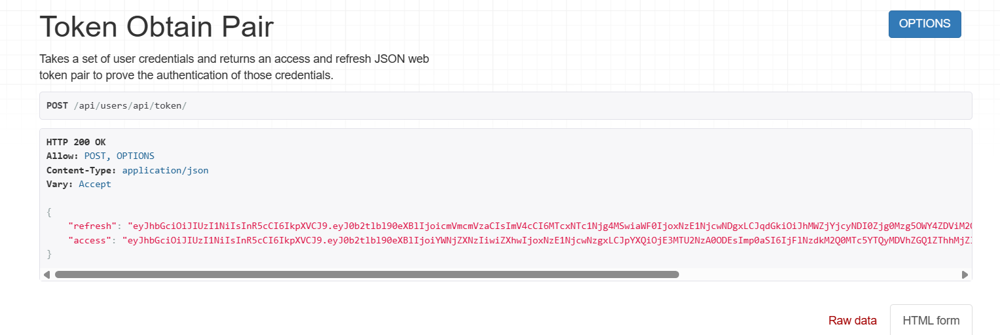
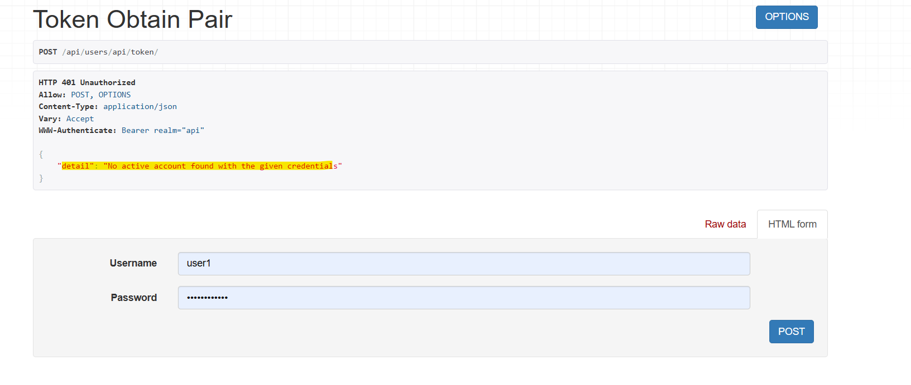
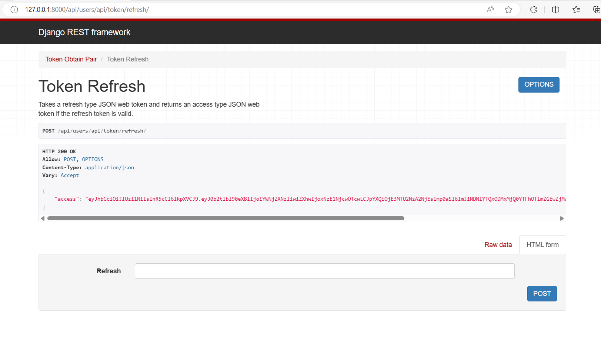
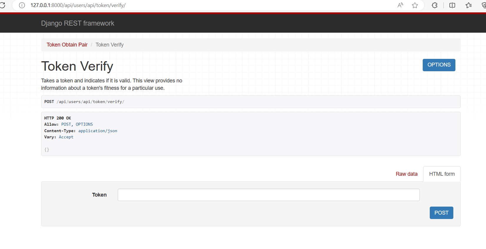

python -m venv env - createing avirtual environment

env/Scripts/activate - activation the virtual environment

pip install django djangorestframework - installing django and rest

django-admin startproject market - creating a backend

cd market - going into the directory

django-admin startapp users - creating am app backend

pip install djangorestframework_simplejwt - for authorizartion

update the rest framework setting in settings.py

REST_FRAMEWORK = {
    'DEFAULT_PERMISSION_CLASSES': [
        'rest_framework.permissions.AllowAny',
    ],
    'DEFAULT_AUTHENTICATION_CLASSES': [
        'rest_framework_simplejwt.authentication.JWTAuthentication',
        # Add other authentication classes if needed
    ],
}

update the urls.py with the 

    path('api/users/',include('users.urls'))

then update the users/urls.py with the tokenizers

from django.urls import path
from rest_framework_simplejwt.views import TokenObtainPairView,TokenRefreshView,TokenVerifyView

urlpatterns = [
    path('api/token/',TokenObtainPairView.as_view(),name='token_obtain_pair'),
    path('api/token/refresh/',TokenRefreshView.as_view(),name='token_refresh'),
    path('api/token/verify/',TokenVerifyView.as_view(),name='token_verify')
]

after running the code using the command python manage.py runserver
the code is working 

created super user using the command python manage.py createsuperuser

username: admin
pass: admin@2024

then executing the command python manage.py runserver

in the link api/users/api/token proviedr the username and password got the response refresh and access

for invalid username and password

in the token/refresh if we give the refesh value got from token it will give a new token

in the token/verify if we give the access value and POST it will give the success message

